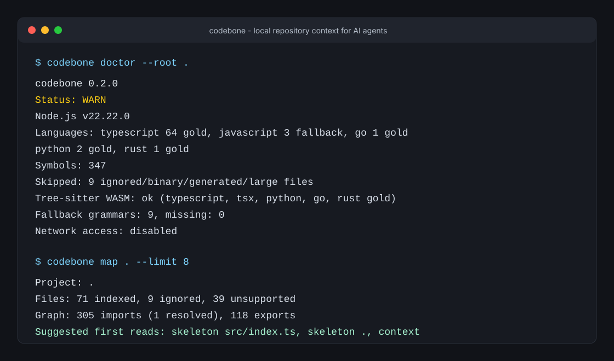

# codebone

**Stop AI coding agents from wasting tokens on grep.**

`codebone` is a local, read-only CLI and MCP server that gives AI coding agents compact, symbol-aware context from your real checkout. It is meant for Claude Code, Codex CLI, Cline, OpenCode, and any other client that can use stdio MCP servers.

Agents usually edit better than they search. `codebone` handles the boring part first: map the project, find the symbols, read only the relevant bodies, and check likely impact before the agent starts changing files.



## What You Get

- a compact project map with languages, entrypoints, imports, exports, and suggested first reads
- file and directory skeletons instead of full-file dumps
- symbol search for definitions, references, imports, and exports
- exact reads by symbol, symbol id, or line range
- task-focused context packs with a fixed token budget
- impact analysis for likely references, related files, and tests
- stable JSON responses for MCP clients
- local-only analysis with no telemetry, no LLM calls, and no source upload

The short version: use `codebone` before an agent opens half the repository.

## Install

```bash
npm install -g codebone
codebone doctor --root /absolute/path/to/repo
```

Requires Node.js 18 or newer.

Runtime analysis does not call LLM APIs, upload source code, or shell out to `grep`, `rg`, `git`, language toolchains, or package managers. The explicit `codebone index` command is the only command in the normal workflow that writes a local `.codebone/index.v1` cache.

## 60-Second Demo

Run this inside any repository:

```bash
codebone doctor
codebone map . --format json --limit 20
codebone skeleton src/index.ts --signatures
codebone context --goal "understand MCP server implementation" --budget 8000 --format json
codebone impact src/mcp-server.ts --format md
```

Local development works the same way:

```bash
npm install
npm run build
node dist/index.js doctor
```

## The Agent Workflow

Without `codebone`, a coding agent often does this:

1. search for a vague term
2. open a long list of files
3. read unrelated code
4. spend the context window on setup instead of the actual change
5. ask for more context

With `codebone`, the same agent can start with:

1. `codebone_map` to understand the repository shape
2. `codebone_symbols` to locate the real symbols
3. `codebone_read` to read exact function or class bodies
4. `codebone_context` to build a compact task pack
5. `codebone_impact` to see likely affected files and tests

That does not replace judgment. It just gives the agent a smaller, cleaner first pass.

## MCP Setup

Use stdio transport and pass an absolute `--root`.

```bash
codebone mcp --root /absolute/path/to/repo
```

### Claude Code

Checked against Anthropic Claude Code MCP docs on 2026-05-17.

```bash
claude mcp add codebone -- codebone mcp --root /absolute/path/to/repo
```

Project `.mcp.json`:

```json
{
  "mcpServers": {
    "codebone": {
      "command": "codebone",
      "args": ["mcp", "--root", "/absolute/path/to/repo"]
    }
  }
}
```

### Codex CLI

Checked against OpenAI Codex CLI MCP configuration docs on 2026-05-17.

Add this to `~/.codex/config.toml`:

```toml
[mcp_servers.codebone]
command = "codebone"
args = ["mcp", "--root", "/absolute/path/to/repo"]
enabled = true
startup_timeout_sec = 20
tool_timeout_sec = 120
```

### Cline

Checked against Cline MCP configuration docs on 2026-05-17.

```bash
cline mcp add codebone -- codebone mcp --root /absolute/path/to/repo
```

Or edit `cline_mcp_settings.json`:

```json
{
  "mcpServers": {
    "codebone": {
      "command": "codebone",
      "args": ["mcp", "--root", "/absolute/path/to/repo"],
      "disabled": false,
      "alwaysAllow": []
    }
  }
}
```

### OpenCode

Checked against OpenCode MCP server docs on 2026-05-17.

`opencode.json`:

```json
{
  "$schema": "https://opencode.ai/config.json",
  "mcp": {
    "codebone": {
      "type": "local",
      "command": ["codebone", "mcp", "--root", "/absolute/path/to/repo"],
      "enabled": true
    }
  }
}
```

More client notes live in [docs/mcp-clients.md](docs/mcp-clients.md).

## CLI Commands

```bash
codebone map . --limit 100 --offset 0
codebone skeleton src/index.ts --signatures
codebone symbols src --query createServer --limit 20
codebone read src/mcp-server.ts --symbol createSdkServer
codebone context --goal "add MCP impact tool" --symbols "createSdkServer" --budget 8000
codebone impact src/mcp-server.ts --symbol createSdkServer --format md
codebone index .
codebone doctor
```

## MCP Tools

- `codebone_map` - compact project overview
- `codebone_skeleton` - file or directory structure without full bodies
- `codebone_symbols` - definitions, references, imports, and exports
- `codebone_read` - exact symbol, line range, or small-file reads
- `codebone_context` - task-focused context pack
- `codebone_impact` - likely affected files, references, relationships, and tests
- `codebone_index` - optional local index for repeated lookups
- `codebone_batch` - multiple operations in one MCP call
- `codebone_doctor` - parser, config, cache, limit, and setup diagnostics

Every successful MCP call returns structured data, a human-readable text payload, `schemaVersion: "codebone.v1"`, `warnings`, `truncated`, `tokenEstimate`, and `tokenEstimator: "char-div-4"` where token estimates apply.

See [docs/tools.md](docs/tools.md) for schemas and examples.

## Why Not Just Use Grep?

`grep` and `ripgrep` are excellent human tools. They are a poor first interface for agents because they return lines, not decisions. An agent still has to guess which files matter, open too much code, and spend context on discovery.

`codebone` gives an agent a higher-level shape first: project map, skeletons, symbols, exact reads, context packs, and impact hints.

## Why Not LSP or RAG?

LSP is great inside an IDE. `codebone` is different: it exposes agent-native CLI and MCP tools with stable JSON, budgeted output, and no IDE requirement. It can complement LSP rather than replace it.

RAG and embeddings can help with documentation and semantic search, but they are often stale, remote, or expensive to refresh. `codebone` reads the live local checkout and keeps the default runtime path simple.

## Language Support

Gold support:

- TypeScript
- Python
- Go
- Rust

Gold means parser smoke coverage exists and symbol extraction is syntax-aware.

Fallback support:

- JavaScript
- Java
- C / C++
- C#
- Ruby
- PHP
- Swift
- Kotlin
- Lua

Fallback means `codebone` uses lightweight syntax rules and text fallback. It is useful for maps and rough context, but it is not promised to match Gold precision.

## Security model

`codebone` is safe to expose to coding agents by default:

- read-only source analysis
- no source-code upload
- no telemetry
- no LLM API calls
- no runtime shell-outs to external code tools
- root path confinement
- stable MCP error shapes instead of uncaught crashes
- ignored, generated, binary, and oversized files skipped before expensive reads

The explicit `codebone index` command writes an optional local `.codebone/index.v1` index. Other runtime analysis commands are local read-only.

## Configuration

Config precedence:

1. CLI flags
2. `.codebonerc.json`
3. `package.json#codebone`
4. defaults

Example:

```json
{
  "defaultBudget": 8000,
  "maxBudget": 50000,
  "batchBudget": 50000,
  "maxFiles": 10000,
  "maxFileBytes": 1048576,
  "timeoutMs": 30000,
  "cache": { "enabled": true, "maxFiles": 5000, "maxBytes": 67108864 },
  "ignore": ["dist/**", "*.generated.*"],
  "testPatterns": ["**/*.test.*", "**/*.spec.*", "tests/**"],
  "entrypoints": ["src/index.ts"]
}
```

Token estimates use:

```text
estimatedTokens = ceil(charCount / 4)
```

Responses that report estimates also identify the estimator as `char-div-4`. This is a deterministic budget estimate, not a model-specific tokenizer.

See [docs/configuration.md](docs/configuration.md).

## Token savings benchmark

Run:

```bash
npm run bench:tokens
```

The benchmark compares a naive full-file exploration baseline with a `codebone` context pack on the current repository. It is intentionally local and simple; treat it as a reproducible context-size comparison, not as a scientific LLM evaluation.

## Documentation

- [Quickstart](docs/quickstart.md)
- [MCP clients](docs/mcp-clients.md)
- [MCP tools](docs/tools.md)
- [Agent instructions](docs/agent-instructions.md)
- [Configuration](docs/configuration.md)

## Development

```bash
npm install
npm run typecheck
npm test
npm run build
npm run bench:tokens
npm run docs:check
```

Release checks:

```bash
npm run release:check
```

## Roadmap

- deeper syntax-aware relationship extraction
- optional LSP interop without making LSP a runtime dependency
- more contract fixtures for fallback languages
- IDE extension, TUI, HTTP server, and package-manager integrations in future releases

## License

MIT
